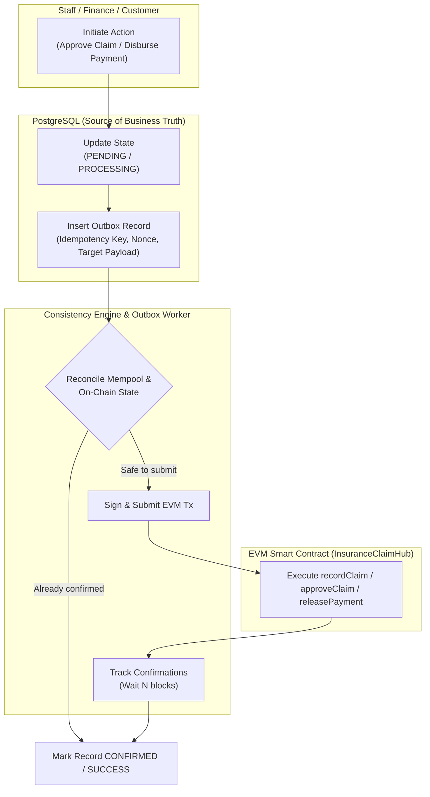

# Distributed Consistency Architecture: Database & Blockchain
## Insurance Claim Processing System

### 1. The Distributed Consistency Challenge

A fundamental limitation in Web3-integrated enterprise applications is that a relational database (PostgreSQL) and a decentralized blockchain network (Ethereum/EVM) **cannot participate in a single atomic ACID 2-phase commit transaction**.

Specifically, this introduces 5 critical failure scenarios:
1. **Scenario 1 (DB Success, Blockchain Failure)**: The claim is approved in the database, but the RPC call fails (network partition, gas spike, out of gas, node timeout).
2. **Scenario 2 (Blockchain Success, App Crash)**: The transaction is successfully mined on-chain, but the backend application server crashes or restarts before recording the transaction hash in PostgreSQL.
3. **Scenario 3 (Mined Transaction, DB State Stale)**: The blockchain transaction reaches confirmation depth, but webhook/listener fails to update the payment row to `SUCCESS`.
4. **Scenario 4 (Transaction Replacement / Speed-up)**: A pending transaction's nonce is reused or gas price is bumped, producing a new hash while the previous hash becomes orphaned.
5. **Scenario 5 (Retry After Timeout / Network Flap)**: An operator or retry worker re-executes payment disbursement while an in-flight transaction is still pending in the mempool, risking **double-payment**.

---

### 2. The Solution: Transactional Outbox & Reconciler Architecture

To achieve eventual consistency and zero financial loss, the system employs the **Transactional Outbox Pattern** combined with **Idempotent Settlement**:



---

### 3. Detailed Handling of Failure Scenarios

#### Scenario 1: DB Success, Blockchain Fails
- **Detection**: The Outbox Worker polls for records where `status = 'PENDING'` with `retry_count < max_retries`.
- **Handling**: Exponential backoff with jitter (e.g. 5s, 15s, 45s, 120s). If retries exhaust, transaction is flagged as `FAILED_NEEDS_MANUAL_REVIEW`, an audit alert is triggered, but funds are never double-disbursed.

#### Scenario 2: Blockchain Success, App Crash
- **Detection**: Upon recovery, the worker reads all unfinished outbox events.
- **Handling**: The worker checks the Smart Contract state using the deterministic claim hash (`getClaim(bytes32 claimHash)`). If the claim on-chain is already in `Approved` or `Paid` status, the worker **reconciles immediately** without submitting a new transaction:
  ```typescript
  const onChainClaim = await contract.getClaim(claimHash);
  if (onChainClaim.status === OnChainStatus.Approved) {
    // Reconcile database state to match blockchain truth
    db.updateClaimStatus(claimId, ClaimStatus.APPROVED, onChainTxHash);
  }
  ```

#### Scenario 3: Transaction Confirmed, DB Not Updated
- **Detection**: Background reconciliation worker scans `blockchain_transactions` with status `PENDING`.
- **Handling**: Queries standard JSON-RPC `eth_getTransactionReceipt(txHash)`. If `receipt.status === 1` and `blockNumber + CONFIRMATION_THRESHOLD <= currentBlock`, update local DB transaction to `CONFIRMED` and payment to `SUCCESS`.

#### Scenario 4: Transaction Replaced / Dropped
- **Detection**: An in-flight transaction with nonce $N$ disappears from mempool or is replaced by a tx with the same nonce and higher gas.
- **Handling**: The reconciliation worker inspects the signer account's current nonce (`eth_getTransactionCount`). If current nonce $> N$, query mined transactions by block range to retrieve the replacement hash.

#### Scenario 5: Double-Payment Prevention (Zero-Tolerance)
- **Safeguard 1 (Database Unique Constraint)**: `payments.claim_id` has a `UNIQUE` constraint, allowing strictly 1 payout record per claim.
- **Safeguard 2 (Smart Contract Guard)**: The smart contract enforces:
  ```solidity
  require(claim.status != ClaimStatus.Paid, "Claim has already been paid");
  require(claim.status == ClaimStatus.Approved, "Claim not approved");
  ```
- **Safeguard 3 (Pre-flight Mempool Reconciliation)**: Before broadcasting any disbursement transaction, `BlockchainService.recordPaymentDisbursement` inspects:
  - Any confirmed transaction on this `paymentId` or `claimId`.
  - Any pending mempool transaction targeting the same claim.

---

### 4. Idempotency Key Specification
Every state mutation request includes an `idempotencyKey` formatted as:
$$\text{idempotencyKey} = \text{SHA256}(\text{actorId} + \text{action} + \text{entityId} + \text{clientToken})$$
Duplicate requests with identical idempotency keys within 24 hours immediately return the previously generated transaction hash and entity state without re-executing business or blockchain logic.
