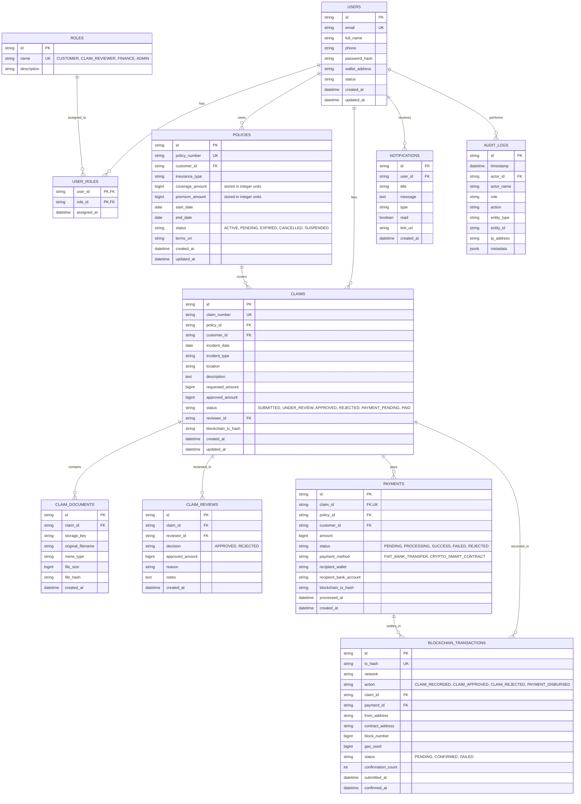

# Database Design & Entity Relationship Diagram (ERD)
## Insurance Claim Processing System

This document specifies the relational database schema, integrity constraints, indexing strategy, and ERD for the Insurance Claim Processing System.

### Design Principles
1. **Financial Integrity**: Money amounts are stored as integer values in minor units (e.g. cents for USD or whole dong for VND) to eliminate floating-point imprecision.
2. **PII and Evidence Isolation**: Customer personal data, health details, and raw documents are stored securely in the database and object storage; only cryptographically generated hashes and state transitions are anchored to the blockchain.
3. **Audit Immutability**: The `audit_logs` table is append-only. No records may be deleted or updated in place.
4. **Referential Integrity**: Cascading deletes are prevented on critical entities (`claims`, `payments`, `audit_logs`) to prevent accidental destruction of compliance records.

---

### Mermaid Entity-Relationship Diagram

